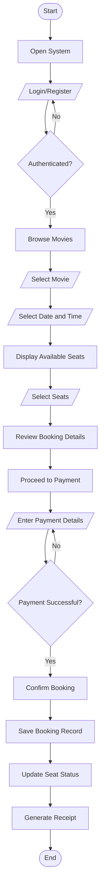

```mermaid
flowchart TD
    A([Start]) --> B[Open System]
    B --> C[/Login/Register/]
    C --> D{Authenticated?}
    D -->|Yes| E[Browse Movies]
    D -->|No| C
    E --> F[/Select Movie/]
    F --> G[/Select Date and Time/]
    G --> H[Display Available Seats]
    H --> I[/Select Seats/]
    I --> J[Review Booking Details]
    J --> K[Proceed to Payment]
    K --> L[/Enter Payment Details/]
    L --> M{Payment Successful?}
    M -->|Yes| N[Confirm Booking]
    N --> O[Save Booking Record]
    O --> P[Update Seat Status]
    P --> Q[Generate Receipt]
    Q --> R([End])
    M -->|No| L
```
